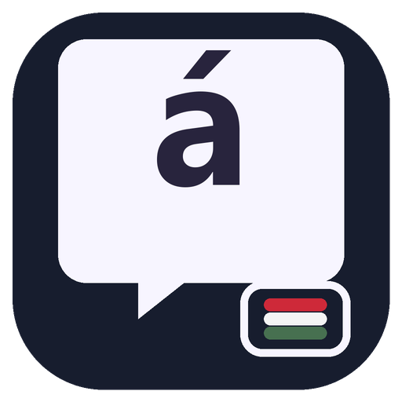
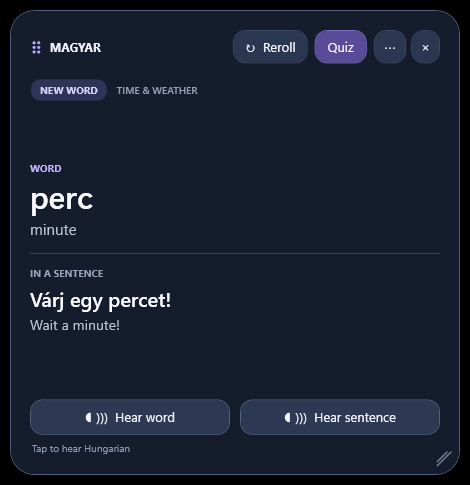

<p align="center">
  
</p>

# Magyar — Hungarian desktop learner

Magyar is a small, floating Windows study card. Every card teaches one Hungarian word with its English meaning, then shows that word in a Hungarian example sentence and gives the sentence's English translation. Separate buttons play the word or sentence pronunciation.

## Run it

Build the self-contained Windows x64 package with the command under **Build from source**, then launch `dist\MagyarWidget\MagyarWidget.exe`. It does not need a separate .NET installation and opens in the lower-right corner above other windows by default.

## Screenshot



The quiz opens inline and makes the widget taller while it is in use.

- **Reroll** shows another word from the enabled categories. New words come first; due review cards follow. A word will not repeat within the active rotation.
- Hover over a word marked **HOVER FOR FORMS & MORE** to see useful verb forms, noun plurals and object forms, plus selected synonyms or related words. The reference notes currently cover 40 verbs and 152 nouns; they are concise learning aids, not complete grammar tables.
- **Quiz** expands the widget and asks up to three questions using cards you have seen. Choose an answer for feedback and a short result at the end.
- When the word rotation is exhausted, choose **Start another rotation** to deliberately repeat material.
- **×** hides the widget in the system tray. Double-click the tray icon to show it again; use the menu to exit.
- Drag the dotted handle beside **MAGYAR** to move the widget.
- Drag the diagonal handle in the lower-right corner to resize it. The widget remembers its size and position.
- Open **⋯ → Categories** to choose what appears. All categories are enabled by default; category choices are saved on this PC and also filter quiz questions.
- Use **⋯** or the tray menu to change the light/dark theme, toggle always-on-top, and enable Start with Windows. Startup is off until you enable it.

## Learning data and audio

The starter pack contains 500 word cards across 18 categories, from street talk and shops to health, travel, technology, and hobbies. Each card includes the word's English meaning, a Hungarian example sentence and its English translation, plus separate bundled Hungarian WAV pronunciation for the word and sentence. Hover notes currently cover 40 verbs and 152 nouns, including useful forms and selected synonyms or related words. The voice is synthesized, so it may sound less natural than a human recording, but audio works offline and does not depend on installed Windows voices.

Study progress and preferences are stored locally at `%LOCALAPPDATA%\MagyarWidget\learning.db`. The app makes no network requests and has no account or sync service. See [AUDIO-NOTICE.md](HungarianWidget/Content/AUDIO-NOTICE.md) for the voice-model source and license notes.

## Build from source

Requires the .NET 10 SDK on Windows. Regenerate the expanded vocabulary and WAV pack with the build-only Piper setup described at the top of `HungarianWidget/scripts/generate_audio.py`; the Piper model and Python environment are not included in the app build.

```powershell
python HungarianWidget/scripts/generate_expanded_cards.py
python HungarianWidget/scripts/generate_audio.py
dotnet build HungarianWidget/HungarianWidget.csproj --configuration Release
dotnet publish HungarianWidget/HungarianWidget.csproj --configuration Release --runtime win-x64 --self-contained true -p:PublishSingleFile=true -p:IncludeNativeLibrariesForSelfExtract=true -p:DebugType=embedded -o dist/MagyarWidget
```

## Windows signing

The checked-in source and local build are unsigned. Windows may show a SmartScreen warning for a downloaded build. A verified publisher signature is needed for broad Windows trust; the repository does not contain a signing certificate or private key.
